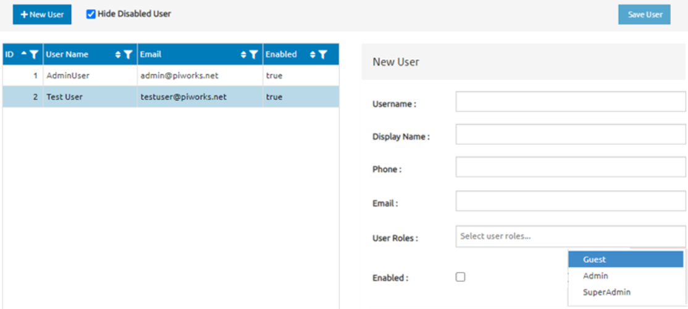

# UI Components & Frontend

>Example of the UI is given below. You have to set the position of the UI components using this example.

> The UI has to be prepared in three sections. The top side of the UI needs to have 2 buttons and 1 checkbox button , the left side has to contain the saved user data and the right side of the UI has to display the new user data. If the user don't press the New User button or it presses the button twice, the left side may remain blank. Save user button can be clicked only when the all of the new user data is given from the user. The checkbox shows disabled users if it is not checked.
---

> Although the UI components and their positions are must, the colors can be changed to reduce the eye strain. Not too dark and bright colors should not be selected. The developer has the full freedom in color selection.